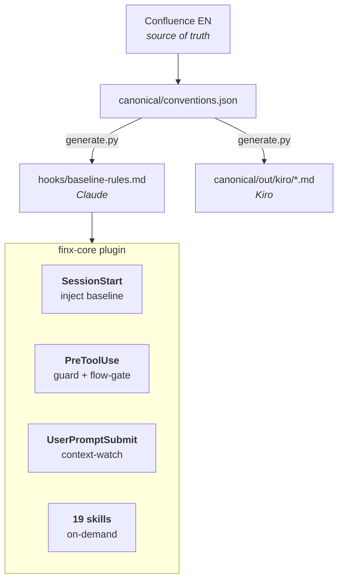
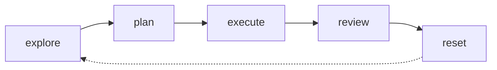

# FinX Claude Conventions

Tiếng Việt: [README.vi.md](README.vi.md)

Shared [Claude Code](https://claude.com/claude-code) plugin (`finx-core`). FinX backend standards as rules, skills and hooks — so every engineer's Claude behaves the same. Java 21/25, Spring Boot 3/4, SBV-compliant banking.

## Install

```
/plugin marketplace add https://github.com/BaoLy-CMC/claude-conventions.git
/plugin install finx-core@finx-conventions
/reload-plugins
```

Open a new session, then run **`/finx-core:onboarding`** — 2-minute tour, sets up your hub and options.

Commands worth remembering:

| | |
|---|---|
| `/flow explore <task>` | start non-trivial work |
| `/flow save` | pause before `/clear` — returns a handle |
| `/finx-core:pre-ship` | before a PR |

## How it works



- **Baseline** — always on, nothing to invoke.
- **Guards** — block `var`, `double` for money, `System.out`, hardcoded secrets. Escape: `FINX_SKIP_HOOKS=1`.
- **Skills** — load when relevant, or by name: reviews, authoring, ops. See [Reference](docs/en/reference.md).
- **Per-engineer opt-ins** — 3 output styles + a flow-aware statusline. Never forced.

## The flow



Non-trivial production Java is gated until a plan is approved. State is **per session**, so many sessions can run at once:

```
<hub>/plans/<group>/<repo>/NNN-slug/plan.md   every repo's plans, one place
<hub>/sessions/<session_id>.json              flow state, one file per session
<hub>/state/<repo-slug>/<handle>.md           resume point for /flow save
```

Hub is configurable (`hub` in `flow-config.json`, default `~/.finx/hub`). Details: [Flow](docs/en/flow.md).

## Docs

[Overview](docs/en/overview.md) · [Rules](docs/en/rules.md) · [Reference](docs/en/reference.md) · [Flow](docs/en/flow.md) · [Releasing](docs/en/releasing.md)

## Changing a rule

Prose lives in Confluence space `EN`, hub "Backend - Conventions & Standards". To change a rule: edit `canonical/conventions.json`, run the generator, cut a release — see [Releasing](docs/en/releasing.md).

## Status

`2.1.0` · 19 skills · 4 hook events · [CHANGELOG](CHANGELOG.md)
