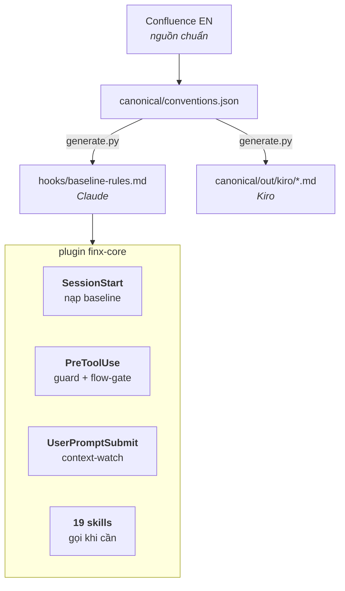
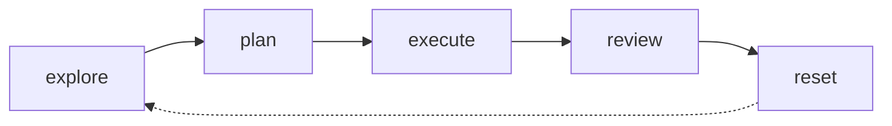

# FinX Claude Conventions

English: [README.md](README.md)

Plugin [Claude Code](https://claude.com/claude-code) dùng chung (`finx-core`). Chuẩn backend FinX đóng gói thành rule, skill và hook — để Claude của mọi người hành xử giống nhau. Java 21/25, Spring Boot 3/4, ngân hàng tuân thủ SBV.

## Cài

```
/plugin marketplace add https://github.com/BaoLy-CMC/claude-conventions.git
/plugin install finx-core@finx-conventions
/reload-plugins
```

Mở session mới, chạy **`/finx-core:onboarding`** — tour 2 phút, dựng hub và các tuỳ chọn cho bạn.

Vài lệnh cần nhớ:

| | |
|---|---|
| `/flow explore <task>` | mở việc lớn |
| `/flow save` | nghỉ giữa chừng trước `/clear` — trả về một handle |
| `/finx-core:pre-ship` | trước khi tạo PR |

## Chạy thế nào



- **Baseline** — luôn bật, không phải gọi gì.
- **Guard** — chặn `var`, `double` cho tiền, `System.out`, secret hardcode. Thoát: `FINX_SKIP_HOOKS=1`.
- **Skills** — tự nạp khi khớp ngữ cảnh, hoặc gọi tên: review, authoring, ops. Xem [Reference](docs/vi/reference.md).
- **Tuỳ chọn cá nhân** — 3 output style + statusline bám flow. Không ép.

## Flow



Code Java production loại lớn bị chặn tới khi plan được duyệt. State khoá **theo session**, nên chạy nhiều session cùng lúc vẫn không đụng nhau:

```
<hub>/plans/<group>/<repo>/NNN-slug/plan.md   plan mọi repo, gom một chỗ
<hub>/sessions/<session_id>.json              flow state, mỗi session một file
<hub>/state/<repo-slug>/<handle>.md           điểm resume của /flow save
```

Hub đổi được (key `hub` trong `flow-config.json`, mặc định `~/.finx/hub`). Chi tiết: [Flow](docs/vi/flow.md).

## Tài liệu

[Tổng quan](docs/vi/overview.md) · [Rules](docs/vi/rules.md) · [Reference](docs/vi/reference.md) · [Flow](docs/vi/flow.md) · [Releasing](docs/vi/releasing.md)

## Sửa một rule

Văn bản chuẩn nằm ở Confluence space `EN`, trang hub "Backend - Conventions & Standards". Muốn sửa rule: sửa `canonical/conventions.json`, chạy generator, cắt release — xem [Releasing](docs/vi/releasing.md).

## Trạng thái

`2.1.0` · 19 skills · 4 hook event · [CHANGELOG](CHANGELOG.md)
